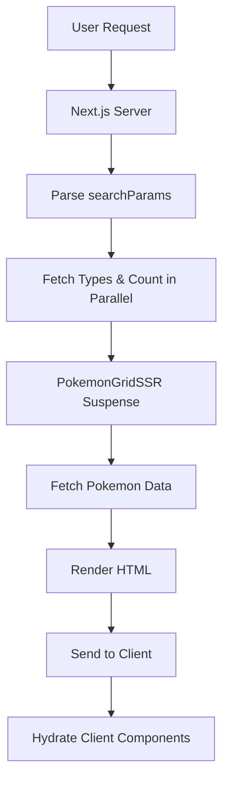
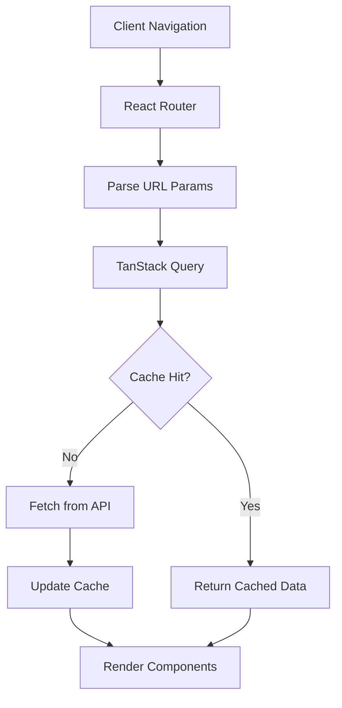
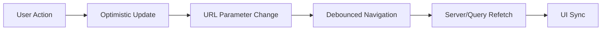

# Architecture Documentation

## Overview

This Pokemon application demonstrates a modern Next.js 15 application with two distinct rendering approaches: Server-Side Rendering (SSR) and Client-Side Rendering (CSR). The architecture emphasizes component reusability, type safety, and performance optimization.

## Project Structure

```
consultis-pokemon/
├── src/
│   ├── app/                     # Next.js App Router
│   │   ├── layout.tsx          # Root layout with providers
│   │   ├── page.tsx            # SSR implementation
│   │   ├── globals.css         # Global styles
│   │   └── csr/
│   │       └── page.tsx        # CSR implementation
│   ├── components/             # React components
│   │   ├── ui/                 # shadcn/ui components
│   │   │   ├── button.tsx      # Enhanced button with cursor pointer
│   │   │   ├── card.tsx        # Card component with forwardRef
│   │   │   ├── badge.tsx       # Badge component
│   │   │   └── input.tsx       # Input component
│   │   ├── Navigation.tsx      # Page navigation
│   │   ├── PokemonCard.tsx     # Pokemon display card
│   │   ├── PokemonGridSSR.tsx  # SSR optimized grid with Suspense
│   │   ├── PokemonSkeleton.tsx # Loading skeleton components
│   │   ├── TypeFilterWithParams.tsx  # Type filter with optimizations
│   │   ├── PaginationWithParams.tsx  # URL-based pagination
│   │   └── QueryProvider.tsx   # TanStack Query setup
│   ├── lib/                    # Utilities and API
│   │   ├── pokemon-api.ts      # API functions with caching
│   │   └── utils.ts           # Utility functions
│   └── types/
│       └── pokemon.ts         # TypeScript interfaces
├── public/                    # Static assets
└── docs/                     # Documentation files
```

## Component Architecture

### Server Components

#### Root Layout (`app/layout.tsx`)

- Provides global metadata and favicon configuration
- Wraps the application with QueryProvider for CSR pages
- Includes hydration warning suppressions for SSR compatibility

#### SSR Page (`app/page.tsx`)

- **Async Server Component**: Fetches data at request time
- **Parallel Data Fetching**: Uses Promise.all for types and Pokemon count
- **Streaming**: Integrates with PokemonGridSSR for progressive loading
- **URL State Management**: Reads searchParams for filtering and pagination

### Client Components

#### CSR Page (`app/csr/page.tsx`)

- **TanStack Query Integration**: Uses useQuery hooks for data management
- **Optimistic UI**: Immediate visual feedback with loading states
- **Error Boundaries**: Comprehensive error handling with retry mechanisms
- **Skeleton Loading**: Rich loading indicators for better UX

#### Shared Components

##### PokemonCard (`components/PokemonCard.tsx`)

```typescript
interface PokemonCardProps {
  pokemon: Pokemon;
}
```

- **Image Optimization**: Uses Next.js Image with proper sizing
- **Type Display**: Color-coded badges for Pokemon types
- **Hover Effects**: Visual feedback with cursor pointer
- **Responsive Design**: Adapts to different screen sizes

##### TypeFilterWithParams (`components/TypeFilterWithParams.tsx`)

- **Optimistic Updates**: Immediate UI changes before server response
- **Debounced Navigation**: 300ms debouncing to reduce server load
- **Transition Management**: Uses React.useTransition for smooth updates
- **State Synchronization**: Manages optimistic vs actual state

##### PokemonGridSSR (`components/PokemonGridSSR.tsx`)

- **Suspense Boundaries**: Streaming SSR with fallback skeletons
- **Server-Side Fetching**: Async data loading within Suspense
- **Error Handling**: Graceful fallbacks for failed requests

## Data Flow Architecture

### SSR Data Flow



### CSR Data Flow



### State Management Flow



## Performance Optimizations

### Server-Side Optimizations

1. **Parallel Data Fetching**

   ```typescript
   const [typesResponse, totalCount] = await Promise.all([
     fetchAllTypes(),
     getTotalPokemonCount(),
   ]);
   ```

2. **Next.js Caching**

   ```typescript
   // 1 hour cache for Pokemon data
   {
     next: {
       revalidate: 3600;
     }
   }

   // 24 hour cache for types (rarely change)
   {
     next: {
       revalidate: 86400;
     }
   }
   ```

3. **Streaming with Suspense**
   ```typescript
   <Suspense fallback={<PokemonGridSkeleton />}>
     <PokemonGrid selectedTypes={selectedTypes} currentPage={currentPage} />
   </Suspense>
   ```

### Client-Side Optimizations

1. **TanStack Query Caching**

   ```typescript
   const queryClient = new QueryClient({
     defaultOptions: {
       queries: {
         staleTime: 5 * 60 * 1000, // 5 minutes
         cacheTime: 10 * 60 * 1000, // 10 minutes
       },
     },
   });
   ```

2. **Debounced Navigation**

   ```typescript
   const debouncedNavigate = useCallback(
     (newSelectedTypes: string[]) => {
       // 300ms debounce
       debounceTimerRef.current = setTimeout(() => {
         startTransition(() => {
           router.push(`?${params.toString()}`);
         });
       }, 300);
     },
     [router, searchParams, startTransition]
   );
   ```

3. **Optimistic UI Updates**
   ```typescript
   const displayedTypes = isPending ? optimisticTypes : selectedTypes;
   ```

## UI/UX Architecture

### Design System

#### Shadcn/UI Integration

- **Consistent Components**: Button, Card, Badge, Input with unified styling
- **Accessibility**: Proper ARIA labels and keyboard navigation
- **Theme Support**: Ready for dark/light mode implementation
- **Responsive Design**: Mobile-first approach with Tailwind CSS

#### Loading States

- **Skeleton Loading**: Animated placeholders during data fetching
- **Progress Indicators**: Visual feedback for ongoing operations
- **Error States**: Clear error messages with retry options

#### Cursor Interactions

- **Cursor Pointer**: All interactive elements have proper cursor styling
- **Hover Effects**: Visual feedback on hover for better UX
- **Disabled States**: Clear indication when elements are not interactive

### Responsive Breakpoints

```css
/* Mobile-first approach */
grid-cols-1 sm:grid-cols-2 md:grid-cols-3 lg:grid-cols-4 xl:grid-cols-6
```

- **Mobile (default)**: Single column layout
- **Small (640px+)**: 2 columns
- **Medium (768px+)**: 3 columns
- **Large (1024px+)**: 4 columns
- **Extra Large (1280px+)**: 6 columns

## Type Safety Architecture

### Strict TypeScript Configuration

```json
{
  "compilerOptions": {
    "strict": true,
    "noImplicitAny": true,
    "noImplicitReturns": true,
    "noUnusedLocals": true,
    "noUnusedParameters": true
  }
}
```

### Interface Design

```typescript
// Core Pokemon interfaces
interface Pokemon {
  id: number;
  name: string;
  sprites: PokemonSprites;
  types: PokemonType[];
}

// API response interfaces
interface PokemonListResponse {
  count: number;
  next: string | null;
  previous: string | null;
  results: PokemonBasic[];
}
```

### Component Props Typing

```typescript
// Strict prop typing
interface TypeFilterWithParamsProps {
  types: TypeBasic[];
}

// No 'any' types throughout the codebase
```

## Security Considerations

### Data Validation

- **API Response Validation**: Proper typing prevents runtime errors
- **URL Parameter Sanitization**: Safe handling of search parameters
- **Error Boundaries**: Graceful handling of unexpected errors

### Performance Security

- **Rate Limiting**: Debouncing prevents API abuse
- **Caching Strategy**: Reduces external API calls
- **Image Optimization**: Prevents memory leaks with proper sizing

## Deployment Architecture

### Build Optimization

- **Static Generation**: Where possible for better performance
- **Bundle Splitting**: Automatic code splitting by Next.js
- **Image Optimization**: Next.js Image component for optimal loading

### Environment Configuration

- **Development**: Hot reloading with Turbopack
- **Production**: Optimized builds with proper caching headers
- **API Integration**: Graceful handling of external API limitations

## Future Scalability

### Component Extensibility

- **Modular Design**: Easy to add new Pokemon features
- **Type Safety**: Prevents breaking changes
- **Performance Patterns**: Established patterns for scaling

### API Scalability

- **Caching Strategy**: Reduces external API dependency
- **Error Recovery**: Robust error handling for API failures
- **Offline Support**: Ready for PWA implementation

This architecture provides a solid foundation for a production-ready Pokemon application while demonstrating modern React and Next.js patterns.
