# Application Flow Documentation

## Overview

This document describes the data flow, user interactions, and state management patterns in the Pokemon application, covering both SSR and CSR implementations.

## User Journey Flow

### Initial Application Load

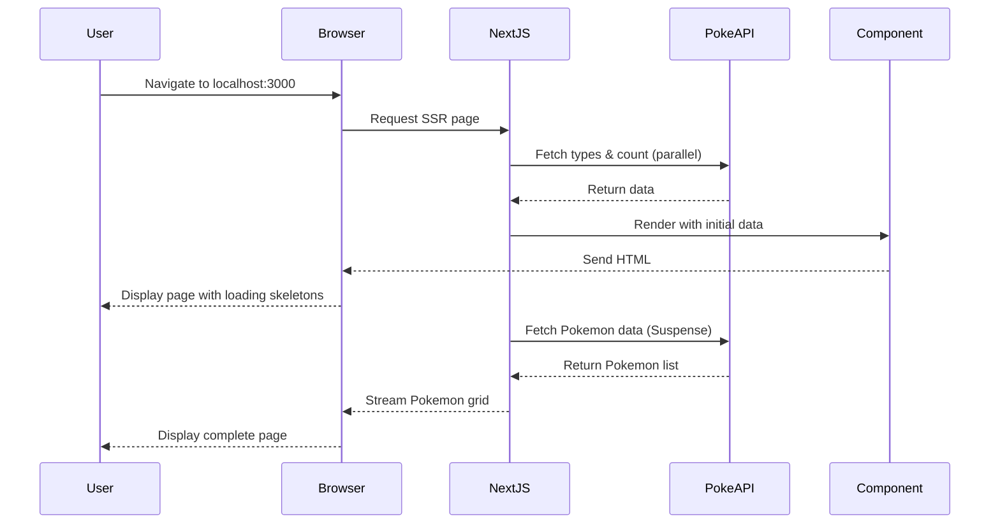

### Navigation Between SSR and CSR

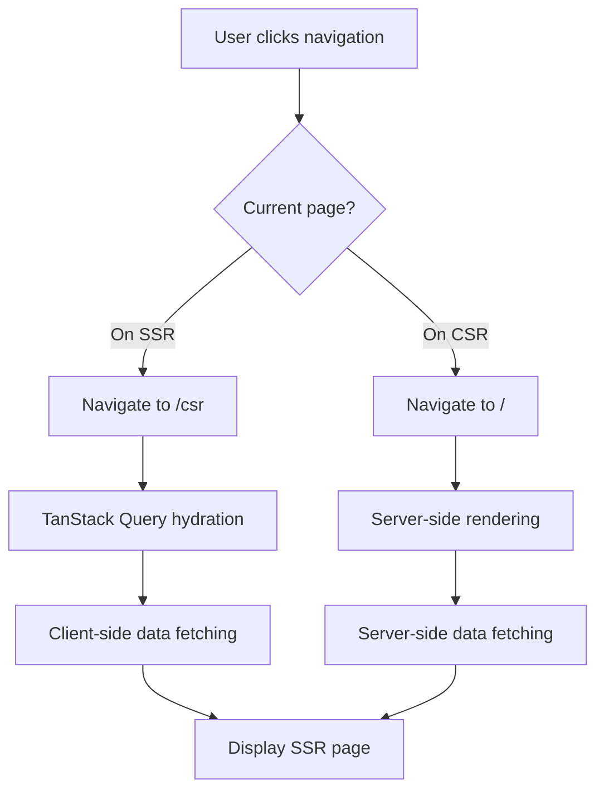

## SSR Flow Details

### Initial Server-Side Rendering

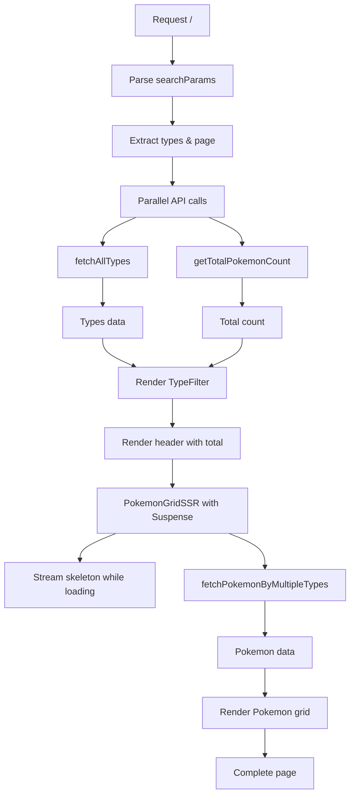

### SSR Type Filter Flow

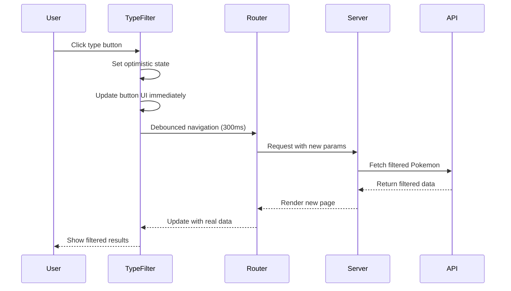

### SSR Pagination Flow

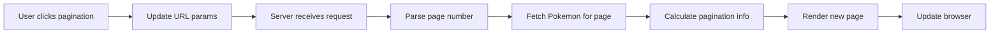

## CSR Flow Details

### Client-Side Initial Load

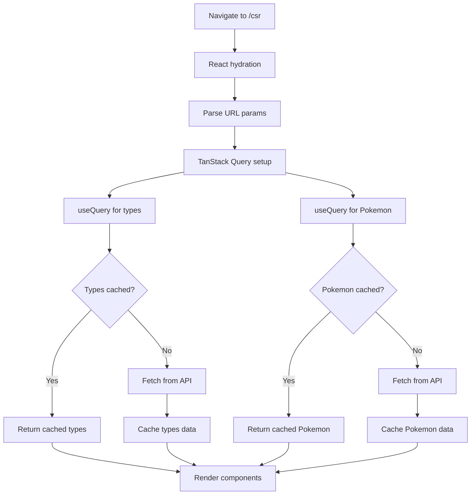

### CSR Type Filter Flow

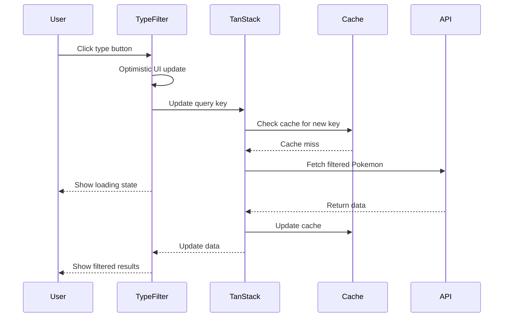

### CSR Error Handling Flow

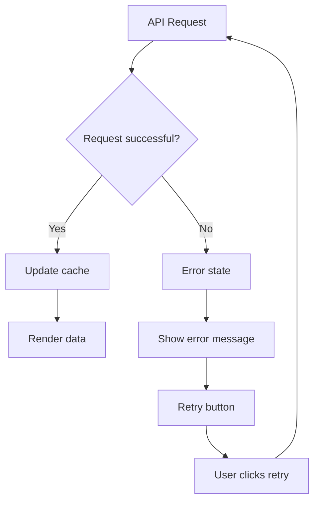

## State Management Flow

### URL State Management

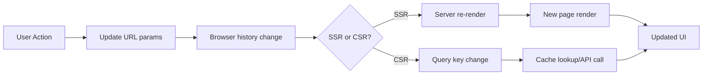

### Optimistic Updates Flow

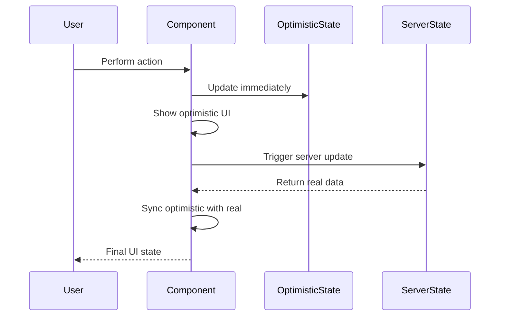

## Performance Optimization Flow

### Debouncing Flow

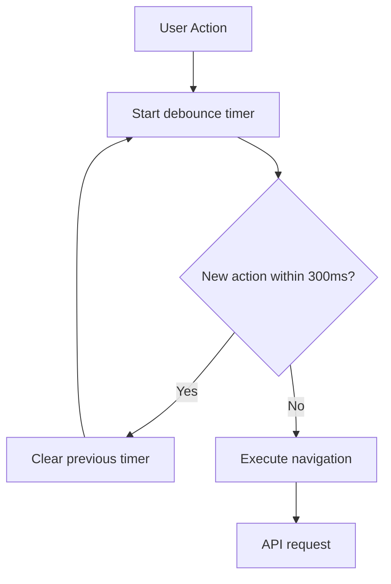

### Caching Strategy Flow

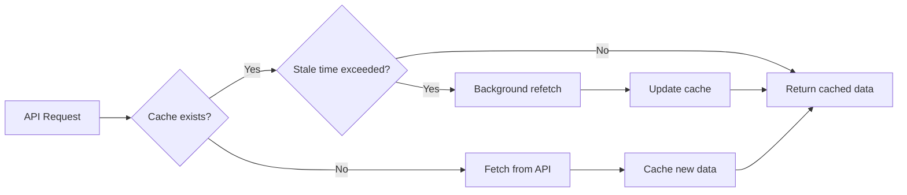

## Error Flow Scenarios

### API Failure Flow

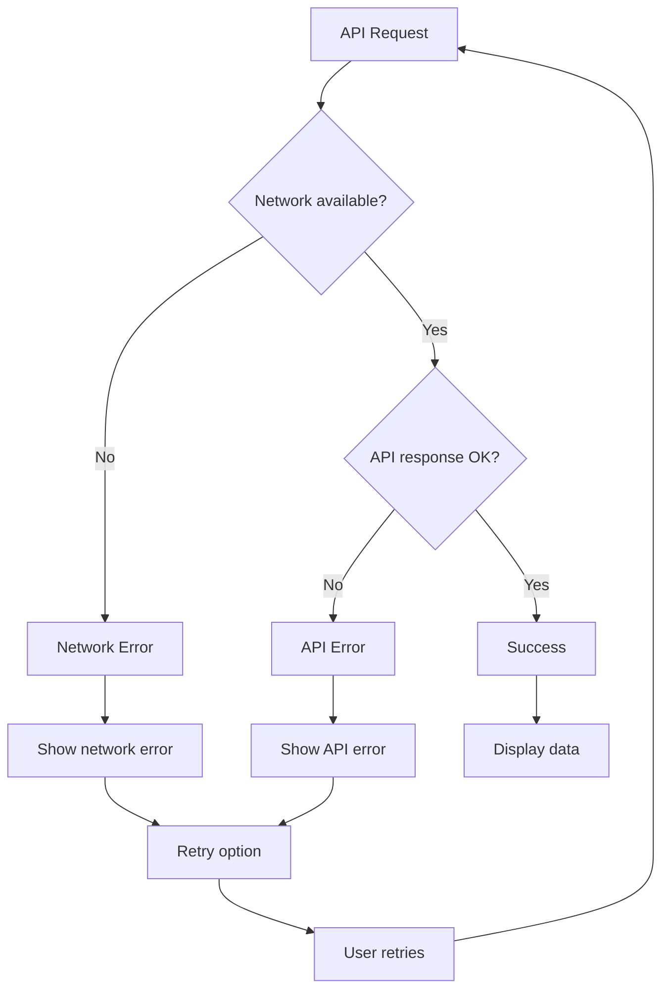

### Hydration Error Flow

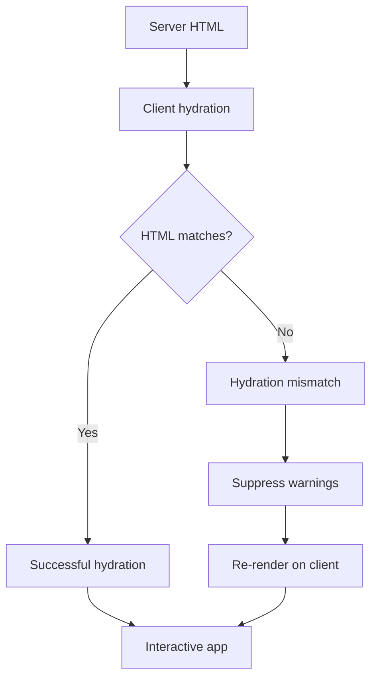

## Component Interaction Flow

### Pokemon Card Interaction

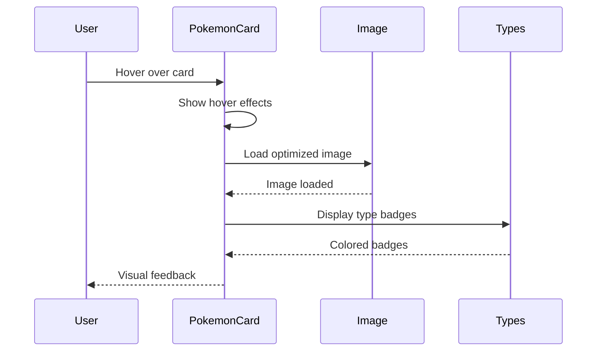

### Type Filter Interaction

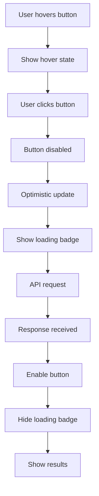

## Data Synchronization Flow

### SSR to CSR Navigation

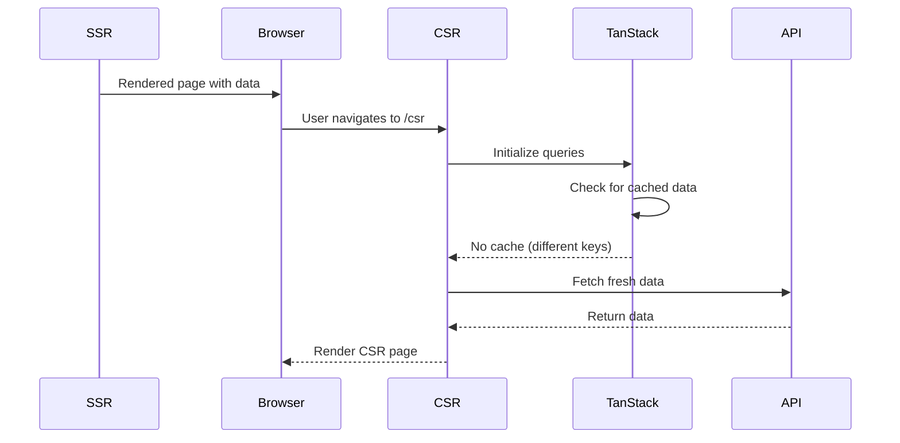

### URL Parameter Synchronization

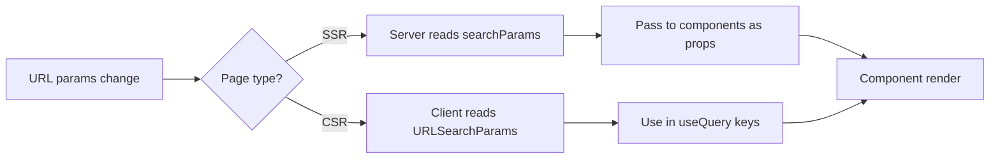

## Loading State Flow

### Progressive Loading (SSR)

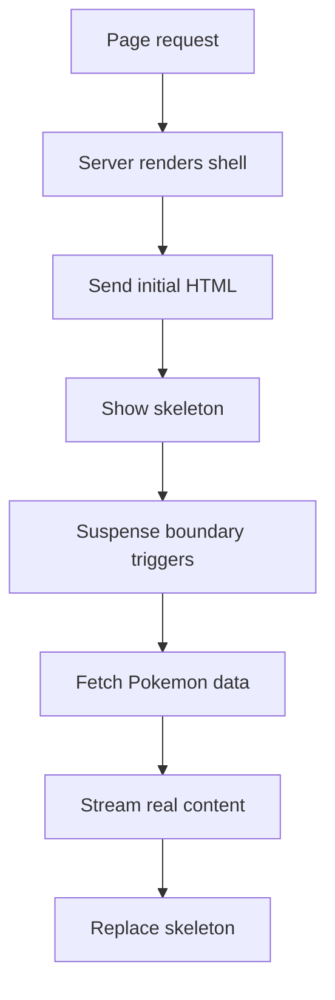

### Loading States (CSR)

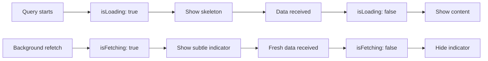

## Real-time User Experience Flow

### Instant Feedback Loop

```mermaid
sequenceDiagram
    participant User
    participant UI
    participant OptimisticState
    participant ServerState

    User->>UI: Click action
    UI->>OptimisticState: Immediate update
    UI-->>User: Instant visual feedback
    UI->>ServerState: Background process
    Note over ServerState: 300ms debounce
    ServerState-->>UI: Real data
    UI->>UI: Reconcile states
    UI-->>User: Final state
```

This flow documentation provides a comprehensive view of how data moves through the application, how users interact with different components, and how the system maintains consistency across different rendering strategies.
